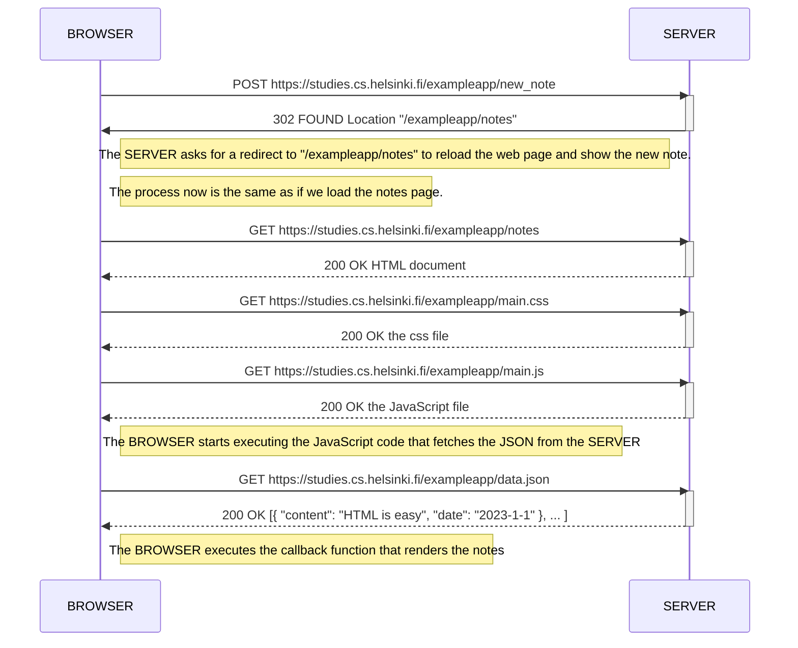

# Sequence diagram of adding a note to the app

```mermaid
sequenceDiagram
    participant BROWSER
    participant SERVER

    BROWSER->>SERVER: POST https://studies.cs.helsinki.fi/exampleapp/new_note
    activate SERVER
    SERVER->>BROWSER: 302 FOUND Location "/exampleapp/notes"
    deactivate SERVER

    Note left of SERVER: The SERVER asks for a redirect to "/exampleapp/notes" to reload the web page and show the new note.

    Note right of BROWSER: The process now is the same as if we load the notes page.

    BROWSER->>SERVER: GET https://studies.cs.helsinki.fi/exampleapp/notes
    activate SERVER
    SERVER-->>BROWSER: 200 OK HTML document
    deactivate SERVER

    BROWSER->>SERVER: GET https://studies.cs.helsinki.fi/exampleapp/main.css
    activate SERVER
    SERVER-->>BROWSER: 200 OK the css file
    deactivate SERVER

    BROWSER->>SERVER: GET https://studies.cs.helsinki.fi/exampleapp/main.js
    activate SERVER
    SERVER-->>BROWSER: 200 OK the JavaScript file
    deactivate SERVER

    Note right of BROWSER: The BROWSER starts executing the JavaScript code that fetches the JSON from the SERVER

    BROWSER->>SERVER: GET https://studies.cs.helsinki.fi/exampleapp/data.json
    activate SERVER
    SERVER-->>BROWSER: 200 OK [{ "content": "HTML is easy", "date": "2023-1-1" }, ... ]
    deactivate SERVER

    Note right of BROWSER: The BROWSER executes the callback function that renders the notes
```