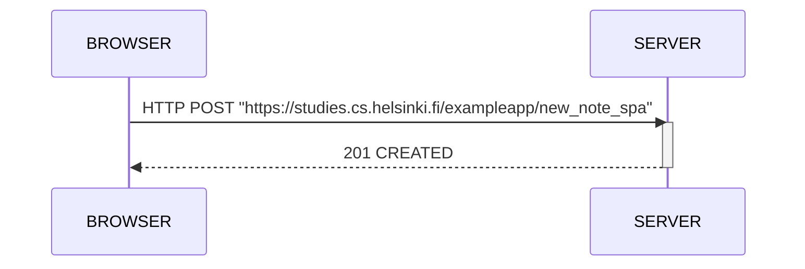

# Sequence diagram of the new note on SPA

### __Anotation:__
- The browser is the one who refresh the notes page using the JavaScript code. In this code, JavaScript capture the form from the HTML code and send it to the server, after doing that he pushes the info to the server. In result, we only have 1 HTTP request and response.
