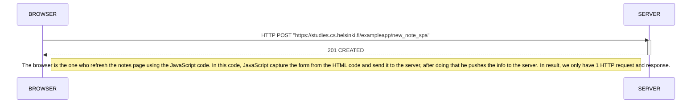

# Sequence diagram of the SPA usage

```mermaid
sequenceDiagram
    participant BROWSER
    participant SERVER

    BROWSER->>SERVER: HTTP POST "https://studies.cs.helsinki.fi/exampleapp/new_note_spa"
    activate SERVER
    SERVER-->>BROWSER: 201 CREATED
    deactivate SERVER

    Note right of BROWSER: The browser is the one who refresh the notes page using the JavaScript code. In this code, JavaScript capture the form from the HTML code and send it to the server, after doing that he pushes the info to the server. In result, we only have 1 HTTP request and response.
```